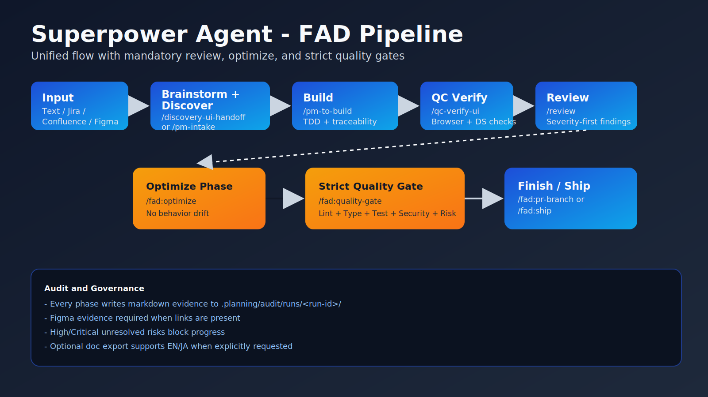

# FAD Pipeline Runbook

This workspace uses `/fad:pipeline` as the default orchestration entrypoint.



## Standard Execution

```bash
/fad:pipeline "<requirement or phase>"
```

The pipeline enforces:

1. Brainstorm/discovery alignment
2. Build execution with requirement trace
3. Review gate
4. Optimize gate
5. Strict quality gate
6. Finish/ship options

## Common Modes

Brownfield strict mode:

```bash
/fad:pipeline "Refactor invoice reconciliation service" --mode brownfield --strict
```

Greenfield with optional export:

```bash
/fad:pipeline "Create a lightweight team planning app" --mode greenfield --doc-export ja
```

## Gate Semantics

- Review blocks on unresolved blocker findings.
- Optimize phase must avoid behavior changes.
- Strict quality gate blocks on:
  - lint/typecheck/test failures
  - security or secret findings
  - unresolved high/critical in-scope risks

## Related Commands

- `/fad:optimize`
- `/fad:quality-gate`
- `/pm-delivery-loop` (legacy wrapper)
- `/pr-feedback-loop`
- `/deploy <env>`
